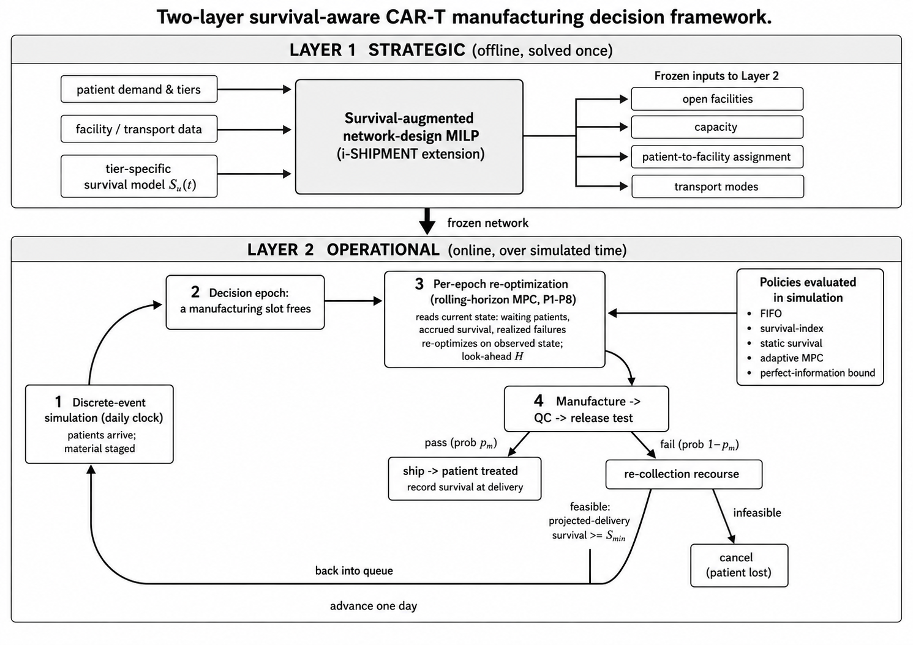

# 3. Methods

## 3.1 Overview of the modelling framework

Autologous CAR-T therapy couples a manufacturing supply chain to a deteriorating
patient. Each therapy is patient-specific and non-substitutable: the cells
collected from a patient can be manufactured only for that patient, so a delay
in the network is not a delay in inventory but a delay in treatment, borne by a
patient whose probability of surviving to infusion is falling. Conventional
supply-chain models treat time through a deadline — a maximum admissible
turnaround — which is a binary and tier-blind representation of a hazard that is
in fact continuous and tier-specific. The framework developed here replaces the
deadline with an explicit survival model, and in doing so makes clinical
prioritisation an *output* of the optimisation rather than an input rule.

The framework has two layers, solved in sequence (Figure 1).

The **strategic layer** (§3.3) is a mixed-integer linear program that extends
the i-SHIPMENT CAR-T network model of Triantafyllou et al. (2022) in two ways.
First, it introduces a genuine manufacturing queue: the start of manufacturing
becomes a decision variable constrained by material arrival and by concurrent
facility capacity, so a job may be *held*. Second, it prices that hold
clinically, through a patient-level survival function embedded exactly in the
objective. The layer decides facility locations, patient–facility assignment,
transport modes, and a nominal schedule.

The **operational layer** (§3.5–§3.6) freezes the strategic decisions and asks
the question the deterministic model cannot: what happens when manufacturing
actually fails? A daily discrete-event simulation advances the clock over the
planning horizon, realises manufacturing yield as a Bernoulli outcome at release
testing, evolves each patient's survival with the accumulated wait, and at every
epoch at which a manufacturing slot frees calls a small look-ahead optimisation
that decides who starts next on the *observed* state. Manufacturing failure
triggers a re-collection recourse gated on projected survival.

This separation is deliberate and reflects the decision horizons of the real
system: facilities and contracts are committed once, over years; sequencing
decisions are made daily, under information that did not exist when the network
was designed. It also yields a clean identification strategy. Because the
network is frozen and shared across every policy we compare, and because
manufacturing failures are generated by common random numbers keyed to the
patient and attempt rather than to call order (§3.9), any difference in outcome
between two policies is attributable to sequencing alone — not to a different
network, a different cost structure, or a luckier draw.

> **Figure 1. Two-layer survival-aware CAR-T manufacturing decision framework.**
> **Layer 1 (strategic, offline, solved once)** combines patient demand and tier
> composition, facility and transport data, and the tier-specific survival model
> S_u(t) in a survival-augmented network-design MILP extending i-SHIPMENT,
> Equations (1)–(35). Its solution fixes four quantities — open facilities,
> capacity, patient-to-facility assignment and transport modes — which pass to
> Layer 2 as a frozen network and are never re-decided there. **Layer 2
> (operational, online, over simulated time)** advances a daily discrete-event
> clock (1) on which patients arrive and material is staged. A decision epoch (2)
> is triggered whenever a manufacturing slot frees; the per-epoch rolling-horizon
> problem — Equations (37)–(44), labelled P1–P8 in the figure — then reads the
> current state (waiting patients, accrued survival, failures realised so far)
> and re-optimises over a look-ahead window H, implementing only the immediate
> start. The started job proceeds through manufacturing, QC and release testing
> (4), passing with probability p_m — in which case it ships and the patient is
> treated, with survival recorded at delivery — or failing with probability
> 1 − p_m, in which case the re-collection recourse applies: feasible if
> projected survival at the remake's delivery is at least S_min, Equation (45),
> returning the patient to the queue with a larger accrued wait, and otherwise
> cancelled. The clock then advances one day. The five policies evaluated (FIFO,
> survival-index, static survival, adaptive MPC, and the perfect-information
> bound) enter at the per-epoch decision point (3) and differ only there: each is
> executed on the identical frozen network and, through common random numbers,
> the identical realised failures.

## 3.2 Notation

Sets: patients p ∈ P with risk tier u(p) ∈ {H, M, L}; manufacturing sites
m ∈ M; leukapheresis sites c ∈ C; hospitals h ∈ H; transport modes j ∈ J;
periods t ∈ T = {1, …, 130}; and Θ ⊂ C × H the set of co-located
leukapheresis–hospital pairs.

Parameters retained from i-SHIPMENT: capital and variable facility cost CIM_m,
CVM_m; concurrent capacity FCAP_m; unit transport costs U1_cmj, U3_mhj;
transport times TT1_j, TT3_j; stage durations T_LS, T_MFE, T_QC; per-therapy
material and release-testing costs C_mat, C_QC; the arrival incidence INC_pct;
the flow bounds FMIN, FMAX; and the maximum turnaround ND.

Parameters introduced here: the tier reference mortality w_u and the induced
hazard HR_u; the survival scale η and shape γ, and sensitivity κ; the clinical
weight ρ_u; the cost–survival exchange rate α; the manufacturing yield p_m; the
look-ahead horizon H; the re-collection floor S_min; the maximum number of
remakes K_remake; and the re-leukapheresis cost ρ_leuk.

Decision variables retained: facility opening E1_m ∈ {0,1}; link activation
X1_cm, X2_mh ∈ {0,1}; patient routing Y1_pcmjt, Y2_pmhjt ∈ {0,1}; the material
flow variables LSA, LSR, MSO, OUTC, OUTM, INM, DURV, FTD, INH; and the timing
variables STT_p, CTT_p, TRT_p. Variables introduced here: the survival rate
S_p ∈ [0,1]; the queue delay HOLD_p ≥ 0; the material arrival A_pmt; and the
survival indicators δ_{p,d} ∈ {0,1}.

## 3.3 Strategic layer: survival-aware network and queue design

### 3.3.1 Objective

The planner minimises supply-chain cost plus a monetised clinical loss,

  min Z = Σ_p CTM_p + Σ_p TTC_p + (C_mat + C_QC)|P| + α Σ_p ρ_u(p) (1 − S_p),   (1)

where CTM_p is the amortised facility cost and TTC_p the transport cost of
patient p,

  CTM_p = Σ_m E1_m (CIM_m + CVM_m) |T| / |P|,                    ∀p,   (2)
  TTC_p = Σ_cmjt Y1_pcmjt U1_cmj + Σ_mhjt Y2_pmhjt U3_mhj,       ∀p.   (3)

The final term of (1) is the contribution of this work. It carries units of
dollars: α is an explicit value of a statistical life and ρ_u a dimensionless
triage weight, so α ρ_u is the per-tier dollar valuation of an avoided death.
We stress that (1) contains **no priority rule, no tier ordering and no
reserved capacity**. Any prioritisation that emerges does so because S_p falls
faster for higher-hazard tiers, which is a property of the calibration in §3.4,
not of the constraint set.

### 3.3.2 Material balance, capacity and network structure

Constraints (4)–(12) are the time-indexed material balances of i-SHIPMENT,
propagating each patient's material from collection through leukapheresis,
inbound transport, manufacturing, release testing and outbound transport:

  INC_pct = OUTC_{p,c,t+T_LS},                                   ∀p,c,t,       (4)
  OUTC_pct = Σ_mj LSR_pcmjt,                                     ∀p,c,t,       (5)
  LSR_pcmjt = LSA_{p,c,m,j,t+TT1_j},                             ∀p,c,m,j,t,   (6)
  A_pmt = Σ_cj LSA_pcmjt,                                        ∀p,m,t,       (7)
  INM_pmt = OUTM_{p,m,t+T_MFE},                                  ∀p,m,t,       (8)
  OUTM_pmt = Σ_hj MSO_{p,m,h,j,t+T_QC},                          ∀p,m,t,       (9)
  MSO_pmhjt = FTD_{p,m,h,j,t+TT3_j},                             ∀p,m,h,j,t,  (10)
  INH_pht = Σ_mj FTD_pmhjt,                                      ∀p,h,t,      (11)
  DURV_pmt = Σ_{1<τ≤t} (INM_{p,m,τ−1} − OUTM_{p,m,τ}) + OUTM_pmt, ∀p,m,t.     (12)

Equation (7) is where this model departs from its predecessor. In i-SHIPMENT the
manufacturing start is *identified* with material arrival: a job begins the day
its material reaches the site. Here A_pmt records only the arrival, and the start
INM is released as a decision, governed by the queue (27)–(30) below.

Concurrent manufacturing at each site is tracked and capped by

  RATIO_mt = Σ_p DURV_pmt / FCAP_m,                              ∀m,t,        (13)
  CAP_mt = FCAP_m − Σ_p Σ_{t−T_MFE≤τ<t} INM_{p,m,τ},             ∀m,t,        (14)
  Σ_p INM_pmt − Σ_p OUTM_pmt ≤ CAP_mt,                           ∀m,t.        (15)

The network structure — at most two open facilities, links only to open
facilities, exactly one journey per leg, flow permitted only on activated
journeys, and delivery to the hospital co-located with the collection site — is
carried over unchanged:

  Σ_m E1_m ≤ 2,                                                               (16)
  X1_cm ≤ E1_m,  ∀c,m;   X2_mh ≤ E1_m,                           ∀m,h,        (17)
  Y1_pcmjt ≤ X1_cm,  ∀p,c,m,j,t;   Y2_pmhjt ≤ X2_mh,             ∀p,m,h,j,t,  (18)
  Σ_cmjt Y1_pcmjt = 1,  ∀p;   Σ_mhjt Y2_pmhjt = 1,               ∀p,          (19)
  Σ_pht INH_pht ≤ |P|,                                                        (20)
  Y1_pcmjt FMIN ≤ LSR_pcmjt ≤ Y1_pcmjt FMAX,                     ∀p,c,m,j,t,  (21)
  Y2_pmhjt FMIN ≤ MSO_pmhjt ≤ Y2_pmhjt FMAX,                     ∀p,m,h,j,t,  (22)
  Σ_mjt Y2_pmhjt = Σ_t INC_pct,                     ∀p, ∀(c,h) ∈ Θ.           (23)

Timing follows

  STT_p = Σ_ct t · INC_pct,  ∀p;   CTT_p = Σ_ht t · INH_pht,     ∀p,          (24)
  TRT_p = CTT_p − STT_p,   STT_p ≤ CTT_p,                        ∀p,          (25)
  ATRT = (1/|P|) Σ_p TRT_p,                                                   (26)

where TRT_p is the turnaround time of patient p, measured from collection to
infusion, and ATRT its cohort average.

### 3.3.3 The manufacturing queue

Replacing the fixed start with a queue requires four constraints:

  Σ_{τ≤t} INM_pmτ ≤ Σ_{τ≤t} A_pmτ,                               ∀p,m,t,      (27)
  Σ_t INM_pmt = Σ_t A_pmt,                                       ∀p,m,        (28)
  Σ_p DURV_pmt ≤ FCAP_m,                                         ∀m,t,        (29)
  HOLD_p = Σ_{m,t} t (INM_pmt − A_pmt) ≥ 0,                      ∀p.          (30)

Constraint (27) forbids a job from starting before its material has arrived;
(28) requires each routed material to be started exactly once; (29) caps
concurrent manufacturing at each site; and (30) defines the hold, the delay
between arrival at the manufacturing site and the start of manufacturing.

The hold is the **only new degree of freedom in the model**, and this is what
makes the design identifiable. Capacity (29) forces some patients to wait; the
objective (1) chooses *which* patients wait. Because the downstream balances
(8)–(11) shift with the chosen start, TRT_p — and hence S_p — absorb the wait
automatically, without any additional linking constraint.

### 3.3.4 Exact linearisation of survival

The survival model is

  S_p = exp( −κ · HR_u(p) · (TRT_p / η)^γ ),                     ∀p,          (31)

which is nonlinear in TRT_p. Two features of the problem make an *exact*
linearisation available rather than an approximation. First, every duration in
the network is integral, so TRT_p is integer-valued. Second, TRT_p is bounded
below by the fastest feasible route and above by the turnaround cap,

  T_min = T_LS + min_j TT1_j + T_MFE + T_QC + min_j TT3_j = 17 days,
  T_max = ND = 42 days,

so TRT_p is supported on the 26 integers {17, …, 42}. We therefore introduce
binary indicators δ_{p,d}, d ∈ {17, …, 42}, and impose

  Σ_d δ_{p,d} = 1,                                               ∀p,          (32)
  TRT_p = Σ_d d · δ_{p,d},                                       ∀p,          (33)
  S_p = Σ_d σ_{d,u(p)} δ_{p,d},                                  ∀p,          (34)

with σ_{d,u} = S_u(d) precomputed from (31). Because the support of TRT_p is
exactly the breakpoint set, (32)–(34) is not a piecewise-linear approximation:
it reproduces (31) exactly at every feasible point. This is a strengthening of
the SOS2 λ-method used in the original model specification, which the
δ-formulation dominates here precisely because integrality removes the need for
interpolation between breakpoints. We report the implemented formulation rather
than the specified one, and note that the two coincide in value.

Finally,

  TRT_p ≤ ND,                                                    ∀p,          (35)

with ND relaxed from 18 to 42 days. This relaxation is essential and deserves
comment: under ND = 18 the turnaround is pinned to {17, 18} and the survival
term of (1) has almost no support to act on, so the model *cannot* express a
prioritisation preference. Relaxing ND converts the deadline from the binding
timeliness mechanism into a slack outer bound, and lets survival — a continuous,
tier-specific quantity — drive timeliness instead. The relaxation does not
weaken the clinical requirement; it relocates it from a constraint to the
objective, where it can be traded against cost at a stated exchange rate.

### 3.3.5 Exact reformulation and valid inequalities

Three reductions make the model tractable at the scales studied without altering
its feasible set or optimal value.

*Index reduction.* In every feasible solution the routing variables collapse:
constraints (19), (21) and (23) force the single active Y1 of patient p onto its
own collection site and onto the single day t = t⁰_p + T_LS, and force the single
active Y2 onto the hospital co-located with that site. We therefore replace
Y1_pcmjt by y1_{pmj} and Y2_pmhjt by y2_{pmj}, eliminating two index dimensions.
Likewise (13)–(15) with (12) reduce algebraically to a rolling T_MFE-day window
on manufacturing starts, Σ_p Σ_{τ=t−T_MFE+1}^{t} INM_pmτ ≤ FCAP_m. Equivalence
of the reduced and full-index formulations is verified numerically at the
50-patient scale rather than asserted.

*Dominance cuts.* Sites m4, m5, m6 share the capital cost, variable cost and
capacity of m1, m2, m3 respectively but carry weakly higher transport costs from
every collection site. Any solution opening the dominated site without its
counterpart can be relabelled onto the counterpart at no greater cost and with
identical timing, so E1_{m4} ≤ E1_{m1}, E1_{m5} ≤ E1_{m2}, E1_{m6} ≤ E1_{m3}
are valid and objective-preserving.

*Symmetry breaking.* Patients sharing a collection site, a risk tier and an
arrival day are fully interchangeable — identical costs, arrival dynamics and
survival curves — so requiring their start days to be non-decreasing removes a
symmetry group without cutting off any objective value.

*Aggregate throughput cuts.* Constraint (29) admits at most FCAP_m starts in any
T_MFE consecutive days. Partitioning the start-window union into disjoint
T_MFE-day blocks and applying the argument to every prefix yields a family of
cuts of the form k · Σ_m FCAP_m E1_m ≥ (number of patients whose start window
ends by T). These are implied by (29) and therefore change neither the feasible
set nor the optimum; they tighten the root relaxation, which is what makes the
largest instances provable.

## 3.4 Survival calibration

The survival model is calibrated to a reference six-week mortality rather than to
a hazard ratio, which makes every parameter clinically interpretable and
identifiable from published outcome data.

Let w_u denote the probability that a tier-u patient dies within T_ref = 42 days
without treatment, so S_u(42) = 1 − w_u. Setting η = T_ref and κ = 1 fixes the
scale, and the hazard follows as HR_u = −ln(1 − w_u), which is *derived* rather
than assumed. With w = {H: 0.15, M: 0.05, L: 0.02} this yields
HR = {0.163, 0.051, 0.020}, a ratio of roughly 8 : 2.5 : 1.

We fix the shape γ = 1, giving a constant baseline hazard and the closed form

  S_u(t) = (1 − w_u)^{t/42}.                                                  (36)

This is the conservative choice, and the reason matters for the credibility of
the results. Under γ = 1 a saved day is worth the same at every point in the
patient's wait; any prioritisation benefit the model finds therefore cannot be
an artefact of an accelerating hazard curve that mechanically rewards serving
the sickest first. Values γ = 1.5 and 2 are retained only as a robustness
sweep. Survival is monotone for every γ > 0, so the qualitative structure is
unaffected.

At the minimum turnaround of 17 days the high-risk tier already sits at
S_H = 0.936 against S_L = 0.992 — a 5.6-point gap that widens to 13.0 points at
42 days. That gap is the entire room the objective has to work with, and it is
absent from the base model, in which turnaround is pinned to 17–18 days.

## 3.5 Operational layer: the per-epoch decision problem

With the strategic layer frozen, a decision epoch occurs whenever a
manufacturing slot frees at an open site. At epoch t the observed state consists
of the ready set W_t of patients whose material is staged at their assigned site;
for each i ∈ W_t, its tier u(i), its accrued wait a_i, a failed-once indicator
φ_i and its frozen site m(i); and the occupancy busy_m(τ) contributed by
in-progress jobs. The only decision is

  x_{i,τ} ∈ {0,1}: start patient i's manufacturing on day τ ∈ [t, t+H] at m(i).

Survival is evaluated from the observed state, not from a nominal plan:

  elapsed_i(τ) = a_i + (τ − t) + T_MFE + T_QC + TT3_{m(i)},      ∀i ∈ W_t, τ,  (37)
  S_i(τ) = (1 − w_{u(i)})^{elapsed_i(τ)/42},                     ∀i ∈ W_t, τ.  (38)

Because the survival clock runs continuously from the *first* collection,
a_i = t − t⁰_i, and (37) simplifies to elapsed_i(τ) = τ − t⁰_i + T_MFE + T_QC +
TT3_i. A remade patient therefore carries the deterioration of every earlier
attempt, which is the property that makes repeated failure clinically costly
rather than merely expensive.

The epoch problem is

  min Σ_{i∈W_t} ρ_{u(i)} (1 − Ŝ_i),                                           (39)

with effective survival

  Ŝ_i = Σ_τ S_i(τ) x_{i,τ} + d_i (1 − Σ_τ x_{i,τ}),   d_i = S_i(t+H),         (40)

subject to

  Σ_τ x_{i,τ} ≤ 1,                                        ∀i ∈ W_t,           (41)
  Σ_{i: m(i)=m} Σ_{τ−T_MFE<τ′≤τ} x_{i,τ′} ≤ FCAP_m − busy_m(τ),
                                                          ∀m, τ ∈ [t, t+H],   (42)
  x_{i,τ} = 0,                                            for τ < t.          (43)

The continuation term d_i in (40) is what prevents (39) from degenerating into a
myopic rule: deferring a patient past the window is charged at the survival that
deferral would cost, so the model weighs serving a patient now against the damage
of not serving them at all within the horizon. The frozen operational cost c^op_i
is inert on a frozen network — it is a per-patient constant and every started
patient is started exactly once — so it does not enter the argmin and is not
monetised into (39); α appears only in the strategic objective (1).

Two structural properties are worth stating. First, because m(i) is frozen, the
patient set partitions across facilities and (42) never couples two of them: the
epoch problem **decomposes exactly by facility**, so solving it per site is
solving it globally. Second, only the immediate start (τ = t) is implemented
before the simulation advances and the problem is re-solved; the remainder of
the look-ahead plan is discarded, in the standard receding-horizon manner.

### 3.5.1 The interpretable index rule

In the special case of a single free slot, H = 0 and no operational cost,
(39)–(43) collapse to a closed form:

  i* = argmax_{i∈W_t} ρ_{u(i)} [ S_i(t) − S_i(t+1) ].                         (44)

Serve whoever's ρ-weighted survival falls most from one further day of waiting.
This is a Whittle-type index: it requires no solver, is inspectable by a
clinician, and is the natural rule to deploy. We evaluate it as a policy in its
own right, and its relationship to the full look-ahead model is an empirical
question we report rather than assume.

## 3.6 Execution environment: discrete-event simulation

The simulation advances a daily clock t = 1, …, T_horizon = 130 over the frozen
network. Within each day, events are processed in the following order.

1. **Arrivals.** Patients collected on day t enter the system; after T_LS + TT1
   days their material is staged and they join W.
2. **Completions and yield.** A job started on day s holds its slot for T_MFE
   days and frees it on day s + T_MFE. T_QC days later it is release-tested: it
   passes with probability p_m and is delivered TT3 days later, at which point
   the patient is treated and their realised survival recorded; it fails with
   probability 1 − p_m, returning the patient to W with φ_i = 1 and a larger
   accrued wait.
3. **Health update.** Accrued waits advance; because the clock is continuous
   from first collection this is implicit in t − t⁰_i.
4. **Decision.** For each site with a free slot and ready patients, the policy
   is called and the chosen jobs start.
5. **Losses.** A patient leaves the system unserved only through the recourse
   rules of §3.6.1.

Manufacturing yield is the sole stochastic element. Arrivals are the fixed
instance arrivals and health evolves deterministically given the wait, so
randomness enters at exactly one point and its effect on outcomes is
identifiable. Expected loss is accumulated as the probability sum Σ_i (1 − S_i)
on each replication's realised timeline, with S = 0 for a patient never treated;
this is a lower-variance estimator than Bernoulli survival draws and is exact
given the timeline.

### 3.6.1 Failure recourse with re-collection

On a manufacturing failure the patient requires a *fresh* leukapheresis. The
recourse is deterministic, consistent with deterministic health evolution:

- **Feasibility.** Re-collection is admissible if and only if projected survival
  at the remake's delivery still clears the floor,

  Ŝ_i(delivery) = (1 − w_{u(i)})^{[a_i + (T_LS + TT1) + wait_i + T_MFE + T_QC + TT3]/42} ≥ S_min,   (45)

  where wait_i is the days until the next free slot at m(i), read from the same
  occupancy busy_m(·) that (42) uses. Because the floor is evaluated on
  *projected* rather than current survival, sicker and later patients cross it
  first, reproducing tier-dependent re-collection eligibility without
  introducing a second stochastic primitive.
- **If feasible**, the remake restarts from collection: T_LS + TT1 days are
  added before manufacturing can resume, the accrued wait grows accordingly, and
  ρ_leuk is charged. The patient re-enters W as a φ = 1, lower-survival
  competitor.
- **If infeasible**, or once K_remake remakes are exhausted, the patient is
  cancelled and carries the full clinical loss.

There is no calendar-based removal of any kind — no raw-wait eligibility cutoff.
A patient still queueing keeps queueing and is credited with whatever survival
their eventual delivery earns, including deliveries falling beyond the reporting
horizon. §3.10 documents why this choice is material.

## 3.7 Policies compared

Five policies are executed on the identical frozen network, with identical
realised failures.

| Policy | Rule |
|---|---|
| `fifo` | Serve in arrival order; no objective. The do-nothing reference. |
| `survival_index` | The closed-form index (44). |
| `static_survival` | The survival schedule optimised once up front — the strategic start order — dispatched greedily and never re-solved. Remakes join the back of the order. |
| `adaptive_mpc` | The full per-epoch model (39)–(43), re-solved at every epoch on the observed state. |
| `best_achievable` | A perfect-information benchmark; see §3.8. |

The four online policies are strictly non-idling: a free slot is never left empty
while a ready patient waits. This is imposed as an equality on the immediate
starts,

  Σ_{i∈W_t} x_{i,t} = min( FCAP_m − busy_m(t), |W_t| ),          ∀m,          (46)

so that policies differ in *whom* they select and never in *how much* capacity
they use — without (46), a policy could appear to reduce clinical loss simply by
withholding capacity.

The design isolates two distinct effects. `fifo` versus the survival-aware
policies identifies the value of survival awareness. `static_survival` versus
`adaptive_mpc` identifies the value of *adaptivity* specifically, since both
optimise the same clinical objective and differ only in whether they re-solve on
observed state.

## 3.8 The perfect-information benchmark

A policy comparison without an attainable floor cannot distinguish a good policy
from an easy instance. We therefore compute, for every replication, the optimal
schedule *given the realised failures*.

Let f_{i,k} ∈ {0,1} indicate that attempt k of patient i fails under the
replication's random draws — known to this model, unknown to every online
policy. Binary variables x_{i,k,τ} start attempt k of patient i on day τ. Attempt
k + 1 may be run only if attempt k was run and failed, and no earlier than that
attempt's release plus a re-collection:

  Σ_τ x_{i,k+1,τ} ≤ Σ_τ x_{i,k,τ},                               ∀i,k,        (47)
  Σ_τ τ x_{i,k+1,τ} ≥ Σ_τ τ x_{i,k,τ} + T_MFE + T_QC + T_LS + TT1
                        − M(1 − Σ_τ x_{i,k+1,τ}),                ∀i,k.        (48)

These are imposed subject to the same rolling-window capacity the simulation
enforces and the same S_min admissibility (45). The objective maximises realised
weighted survival, in which only a successful attempt delivers anything:

  max Σ_i Σ_{k: f_{i,k}=0} Σ_τ ρ_{u(i)} S_{u(i)}(τ + T_MFE + T_QC + TT3_i − t⁰_i) x_{i,k,τ}.  (49)

Three points of interpretation are essential. First, the resulting value is a
valid lower bound on the **ρ-weighted clinical loss Σ_p ρ_{u(p)}(1 − S_p)** —
the clinical-loss term of objective (1) — and *not* on unweighted patient
counts; a policy can and does fall below it on unweighted totals without
contradiction, and we report it only against the quantity it bounds. Second,
this benchmark is deliberately exempt from the non-idling requirement (46):
deliberately holding a slot open for a sicker patient arriving tomorrow is part
of what perfect information buys, and forcing it to be work-conserving would
produce something other than a bound. Third, declining an attempt is itself one
of the decisions foresight permits, since capacity spent on a batch known to
fail is capacity denied to another patient.

The benchmark is executed through the same simulation and accounting code as
every other policy, so that reported costs and metrics are constructed
identically and remain comparable.

## 3.9 Experimental design

**Instances.** All experiments use the i-SHIPMENT network data — four
collection sites, six candidate manufacturing sites with FCAP ∈ {4, 31, 10, 4,
31, 10}, two transport modes — with cohorts built by tiling the 50-patient base
cohort. Tier mix (30/40/30 H/M/L) and the collection-site distribution are
inherited patient by patient, and arrival days are rescaled into the admissible
window so that arrival *density*, and hence congestion, grows with cohort size.
Experiments run at N = 200 (primary) and N = 100 (confirmation); the 50-patient
cohort is used for schedule-level illustration.

**Replication and variance reduction.** Each configuration is replicated over 30
yield seeds. The draw governing attempt k of patient i is a deterministic
function of (seed, patient, attempt) rather than of call order, which delivers
common random numbers in a strong form: the same batches fail under every
policy, at every offered load, and nested across the failure-rate sweep. Policy
contrasts are therefore paired, and the reported standard errors are of
differences that share their noise.

**Design of experiments.** Five experiments address five distinct questions:
the calibration itself (does a day of delay cost tiers differently?); the
prioritisation mechanism (who is served first, and where does the waiting go?);
congestion (when does survival awareness matter?), varied by compressing or
expanding the arrival window on a fixed network so that offered load moves
without confounding the network; the value of life (at what α does the network
*design* change?), the only experiment that re-solves the strategic layer; the
policy benchmark against the bound; and manufacturing failure rate, swept as a
common (1 − p) across all sites so the abscissa is interpretable.

**Reported metrics.** We restrict reporting to five quantities fixed in advance:
expected high-risk patients lost (primary), total expected patients lost, total
cost and cost per therapy, mean hold by tier, and the share of the
`fifo`-to-`best_achievable` gap closed. Both the primary and the total metric
are reported in every experiment, in both directions, so that a policy which
improves one at the expense of the other cannot be presented selectively.

## 3.10 Modelling choices, limitations and reproducibility

Several choices bound the interpretation of the results and are stated here
rather than in a concluding caveat.

*The re-collection floor is weakly binding.* In (45) the term wait_i is read
from in-progress occupancy, which by construction never looks more than
T_MFE − 1 = 6 days ahead. The floor S_min = 0.75 therefore requires an accrued
wait exceeding roughly 50 days for the high-risk tier — and far more for the
others — before it can bind. In practice it binds only for policies whose rigid
ordering allows individual patients to decay substantially. A specification in
which wait_i reflected queue position rather than in-progress occupancy would
make the floor active across all policies; we retain the stated specification
and report the consequence rather than tuning the rule to produce activity.

*Removal versus decay.* Because there is no calendar-based removal, expected
loss is dominated by survival decay accumulated while waiting rather than by
patients removed from the system. This is the intended semantics — the model
prices delay, and delay is continuous — but it means "expected patients lost" is
an expected-mortality quantity, not a count of censored patients.

*Scope of the frozen network.* Assignment and transport mode are inherited from
the strategic solution and are not re-decided per epoch. Expediting an
individual patient by upgrading transport mid-horizon is therefore outside the
policy space, and the reported gains are attributable to sequencing alone. This
understates what a fully flexible operational layer could achieve and is
conservative with respect to our claims.

*Horizon spillover.* Deliveries falling beyond the 130-day reporting horizon are
credited with their realised survival rather than discarded or zeroed. Spillover
is below 5% at the operating point and is reported for every configuration; at
the lowest offered load, where the arrival window is deliberately stretched
beyond the horizon, it is substantially larger and is reported as such.

*Implementation.* The strategic and perfect-information models are built in
Pyomo and solved with Gurobi where the licence admits the model size and with
HiGHS otherwise. The per-epoch models are small — the largest queue observed at
any single facility at N = 200 contains 33 patients, giving at most 264 binary
columns per epoch — and solve under Gurobi throughout. Solver identity, wall
time, MIP gap and model size are recorded for every solve. Every replication
records the seed that produced it, the strategic solution it was frozen against,
and the resulting per-experiment metrics, so that any reported number can be
traced to a specific solve and a specific draw. Code, instance data, cached
strategic solutions and all per-experiment outputs accompany the manuscript.

*Equation numbering.* Equations are numbered sequentially in this manuscript.
For readers cross-referencing the model specification and the accompanying code,
which use a block-structured scheme, the correspondence is:

| This manuscript | Specification / code |
|---|---|
| (1)–(26) | (1)–(26), unchanged |
| (27)–(30) | (32)–(35), manufacturing queue |
| (31) | (27), nonlinear survival |
| (32)–(34) | (28)–(30), linearisation (λ/SOS2 in the specification, δ-binary as implemented) |
| (35) | (31), turnaround cap |
| (36) | survival closed form |
| (37)–(43) | (P1)–(P6), per-epoch problem |
| (44) | (P8), index rule |
| (45) | re-collection gate |
| (46) | non-idling condition |
| (47)–(49) | perfect-information benchmark |
