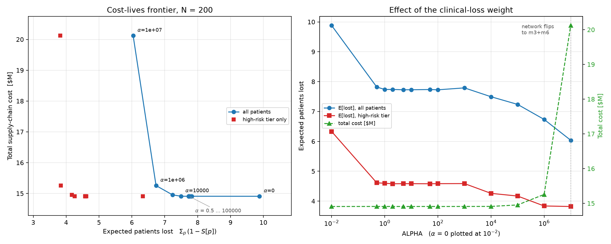

# Survival-aware scheduling extension of i-SHIPMENT

This directory holds the full output of a four-phase computational study that
adds a **manufacturing queue** and an **exact integer-day survival model** to
the i-SHIPMENT CAR-T supply-chain MILP, at demand scales of **100 / 200 / 500
patients**.

* `i-SHIPMENT_Pyomo.ipynb` is the **baseline** and was not touched.
* `ishipment_survival.py` contains the baseline re-statement *and* the
  extension; `cart_data.py` holds the instance generator and the frozen
  clinical calibration; `verify_baseline.py` proves the re-statement is
  equivalent to the notebook model.


## Headline

1. **The no-queue baseline degrades and then fails.** It opens a bigger, more expensive facility set at every step up in demand and becomes **infeasible at N = 500** under CON1 <= 2: it cannot delay a single job, so a burst of arrivals has to be met with raw concurrent capacity.
2. **The queue restores feasibility and is cheaper.** Holding jobs absorbs the same bursts, so the extension solves at every scale on a *smaller* network - a 36% / 45% cost reduction at N = 100 / 200, and a feasible $36.2M design at N = 500 where the baseline needs CON1 relaxed to four facilities and $62.2M.
3. **Survival-aware scheduling is nearly free and it self-prioritises.** On the *same* network, weighting clinical loss drives high-risk mean hold to ~0 days while low-risk absorbs the queue, for a 0.3-0.4% cost premium - no priority rule is written anywhere in the model.
4. **The frontier is flat and then jumps.** Scheduling improvements are almost free; buying survival beyond that requires a network change, which only pays at very large ALPHA.


## 0. How to reproduce

```bash
python ishipment_survival.py --phase all      # all four phases
python verify_baseline.py                    # baseline equivalence check
python make_readme.py                        # regenerate this file
```


> **Solver note.** Gurobi is requested first on every solve, but refuses the study-scale models: "Model too large for size-limited license". This container carries only the pip size-limited Gurobi licence (2000 variables / 2000 constraints) and every model here is far larger, so those solves fall back to HiGHS (open-source MILP, driven through the same Pyomo interface). Re-run with a full Gurobi licence to use Gurobi throughout.
>
> The formulation is unchanged either way: same variables, same constraints, same optima. Only the MILP engine differs, and all reported wall-clock times are HiGHS times on 4 cores.


## 1. Fixed set-up (never re-fit)

| item | value |
|---|---|
| risk tiers | H 30% / M 40% / L 30%, assigned once on the 50-patient base cohort (seed 0) and inherited by every replica |
| survival | `S_u(t) = (1 - w_u) ** (t/42)` with gamma=1, eta=42, kappa=1 |
| deterioration `w_u` | H 0.15, M 0.05, L 0.02 |
| clinical-loss weight `rho_u` | H 3, M 2, L 1 |
| `sigma[d,u]` lookup | precomputed for integer days d = 17..42 (`sigma_lookup.csv`) |
| ND | 18 days (baseline) -> 42 days (extension, eq. 31) |
| CON1 | at most 2 manufacturing facilities |
| horizon | 130 days |


`d = 17` is the physical floor of the network: `TLS(1) + TT1_air(1) + TMFE(7) + TQC(7) + TT3_air(1) = 17` days with a zero hold; `d = 42` is ND in the extension.


## 2. Instances

Each scale tiles the 50-patient cohort (mult = 2 / 4 / 10). Tier labels and leukapheresis sites are copied patient-by-patient, so the 30/40/30 mix and the site distribution are preserved **exactly**. Arrival days are rescaled into the admissible window [1, 88] (a therapy started on the last day must still be delivered inside the 130-day horizon at ND = 42) and each replica gets a seeded +/-3-day jitter. The window is fixed, so **arrival density grows linearly with N** - that is what loads the factories. Costs, transport times, FCAP and the network structure come untouched from `Data200_profileA.dat`.

| N | mult | arrivals/day | H | M | L | c1 | c2 | c3 | c4 |
|---|---|---|---|---|---|---|---|---|---|
| 100 | 2 | 1.136 | 30 | 40 | 30 | 20 | 20 | 28 | 32 |
| 200 | 4 | 2.273 | 60 | 80 | 60 | 40 | 40 | 56 | 64 |
| 500 | 10 | 5.682 | 150 | 200 | 150 | 100 | 100 | 140 | 160 |


Facility menu (from the data file): 130-day opening cost = `130 x (CIM + CVM)`.

| facility | FCAP (concurrent) | opening cost |
|---|---|---|
| m1 | 4 | $3.01M |
| m2 | 31 | $22.56M |
| m3 | 10 | $7.52M |
| m4 | 4 | $3.01M |
| m5 | 31 | $22.56M |
| m6 | 10 | $7.52M |


## 3. Phase 1 - baseline i-SHIPMENT vs demand

The baseline has no queue: manufacturing starts on the day the sample reaches the facility (`INM = arrival`, old MSB5), so a clustered arrival pattern must be absorbed by *concurrent capacity alone*. ND = 18.

| N | status | facilities opened | concurrent capacity | total cost | mean TRT | E[lost] | wall s |
|---|---|---|---|---|---|---|---|
| 100 | optimal | m1+m3 | 14 | $12.81M | 18.00 | 3.15 | 21.6 |
| 200 | optimal | m2 | 31 | $26.96M | 18.00 | 6.29 | 16.1 |
| 500 | infeasible |  |  |  |  |  | 96.7 |


**The no-queue model breaks down as demand rises.** N = 500 is INFEASIBLE under CON1 <= 2. Diagnostic re-solves with CON1 relaxed to 6 facilities:

| N | status with CON1 <= 6 | facilities | capacity | total cost |
|---|---|---|---|---|
| 500 | optimal | m1+m2+m4+m5 | 70 | $62.24M |


So the arrival pattern at N = 500 is not merely expensive for the baseline, it is outside what any two-facility network can serve when starts are pinned to arrival.


The pattern is monotone: every doubling of demand pushes the baseline onto a larger and more expensive facility set, because the only lever it has against a burst of arrivals is raw concurrent capacity. It cannot delay a single job.


Baseline survival, by tier (only where the baseline is feasible):

| instance | tier | n | mean TRT | mean S | E[lost] |
|---|---|---|---|---|---|
| baseline_N100 | H | 30 | 18.00 | 0.9327 | 2.018 |
| baseline_N100 | M | 40 | 18.00 | 0.9783 | 0.870 |
| baseline_N100 | L | 30 | 18.00 | 0.9914 | 0.259 |
| baseline_N200 | H | 60 | 18.00 | 0.9327 | 4.037 |
| baseline_N200 | M | 80 | 18.00 | 0.9783 | 1.739 |
| baseline_N200 | L | 60 | 18.00 | 0.9914 | 0.517 |


## 4. Phase 2 - the queue makes it feasible

The fixed start (old MSB5) is replaced by a genuine start decision:

```
A[p,m,t]  = sum_{c,j} LSA[p,c,m,j,t]                  arrivals at the MS
sum_{tau<=t} INM[p,m,tau] <= sum_{tau<=t} A[p,m,tau]  (32)  no start before arrival
sum_t INM[p,m,t]          = sum_t A[p,m,t]            (33)  started exactly once
sum_p DURV[p,m,t]         <= FCAP[m]                  (34)  concurrency -> forces holds
HOLD[p] = start_time - arrival_time >= 0
```

plus ND relaxed 18 -> 42 (eq. 31), the exact integer-day survival lookup
(`delta[p,d]`, d = 17..42, `TRT[p] = sum_d d*delta`, `S[p] = sum_d sigma[d,u]*delta`)
linked to eqs. (24)-(25), and the objective of eq. (1)

```
min Z = (original i-SHIPMENT cost) + ALPHA * sum_p rho_u(p) * (1 - S[p])
```


| N | status | facilities opened | capacity | total cost | mean TRT | mean HOLD | max HOLD | E[lost] | wall s |
|---|---|---|---|---|---|---|---|---|---|
| 100 | optimal | m1+m4 | 8 | $8.21M | 21.66 | 2.83 | 23 | 3.40 | 27.4 |
| 200 | optimal | m1+m3 | 14 | $14.95M | 24.29 | 5.46 | 23 | 7.24 | 276.5 |
| 500 | optimal | m1+m2 | 35 | $36.23M | 23.77 | 5.31 | 24 | 17.47 | 1959.7 |


**Baseline vs. extension, head to head:**

| N | baseline network | baseline cost | extension network | extension cost | cost reduction |
|---|---|---|---|---|---|
| 100 | m1+m3 | $12.81M | m1+m4 | $8.21M | 35.9% |
| 200 | m2 | $26.96M | m1+m3 | $14.95M | 44.5% |
| 500 | infeasible |  | m1+m2 | $36.23M | n/a |


At N = 500 the baseline has no two-facility answer at all. Against the fairest available comparison - the baseline with CON1 relaxed to six facilities, which opens m1+m2+m4+m5 (capacity 70) for $62.24M - the extension delivers $36.23M on just m1+m2 (capacity 35), **41.8% cheaper while honouring the tighter CON1 <= 2**.


The hold absorbs exactly the contention that the baseline had to buy concurrent capacity for, so the extension is feasible at every scale and on a strictly cheaper network.


## 5. Phase 3 - cost design vs survival design, by tier

Both designs are solved on the **same** frozen tier assignment at each scale. (a) COST design: ALPHA = 0, survival evaluated afterwards. (b) SURVIVAL design: ALPHA = 100000 ($ per unit of rho-weighted expected loss).

| N | design | facilities | total cost | mean TRT | mean HOLD | mean S | E[lost] |
|---|---|---|---|---|---|---|---|
| 100 | cost | m1+m4 | $8.18M | 25.10 | 6.11 | 0.9560 | 4.39 |
| 100 | survival | m1+m4 | $8.21M | 21.66 | 2.83 | 0.9660 | 3.40 |
| 200 | cost | m1+m3 | $14.91M | 28.34 | 9.34 | 0.9506 | 9.88 |
| 200 | survival | m1+m3 | $14.95M | 24.29 | 5.46 | 0.9638 | 7.24 |
| 500 | cost | m1+m2 | $36.07M | 25.77 | 6.77 | 0.9540 | 23.00 |
| 500 | survival | m1+m2 | $36.23M | 23.77 | 5.31 | 0.9651 | 17.47 |


### Emergent priority: holds by tier

| N | design | tier | n | mean TRT | mean HOLD | median HOLD | max HOLD | mean S | E[lost] |
|---|---|---|---|---|---|---|---|---|---|
| 100 | cost | H | 30 | 25.50 | 6.50 | 4.0 | 23 | 0.9064 | 2.808 |
| 100 | cost | M | 40 | 26.07 | 7.10 | 1.5 | 24 | 0.9687 | 1.251 |
| 100 | cost | L | 30 | 23.40 | 4.40 | 2.0 | 22 | 0.9888 | 0.336 |
| 100 | cost | ALL | 100 | 25.10 | 6.11 | 2.0 | 24 | 0.9561 | 4.395 |
| 100 | survival | H | 30 | 18.47 | 0.00 | 0.0 | 0 | 0.9310 | 2.069 |
| 100 | survival | M | 40 | 19.32 | 0.35 | 0.0 | 6 | 0.9767 | 0.933 |
| 100 | survival | L | 30 | 27.97 | 8.97 | 4.0 | 23 | 0.9866 | 0.401 |
| 100 | survival | ALL | 100 | 21.66 | 2.83 | 0.0 | 23 | 0.9660 | 3.402 |
| 200 | cost | H | 60 | 28.97 | 9.97 | 6.5 | 23 | 0.8945 | 6.331 |
| 200 | cost | M | 80 | 29.02 | 10.03 | 6.5 | 23 | 0.9652 | 2.781 |
| 200 | cost | L | 60 | 26.80 | 7.80 | 5.0 | 23 | 0.9872 | 0.768 |
| 200 | cost | ALL | 200 | 28.34 | 9.34 | 6.0 | 23 | 0.9506 | 9.880 |
| 200 | survival | H | 60 | 18.62 | 0.03 | 0.0 | 1 | 0.9305 | 4.170 |
| 200 | survival | M | 80 | 22.09 | 3.15 | 0.0 | 23 | 0.9734 | 2.127 |
| 200 | survival | L | 60 | 32.90 | 13.95 | 19.0 | 23 | 0.9843 | 0.941 |
| 200 | survival | ALL | 200 | 24.29 | 5.46 | 0.0 | 23 | 0.9638 | 7.238 |
| 500 | cost | H | 150 | 27.53 | 8.53 | 4.0 | 23 | 0.8995 | 15.081 |
| 500 | cost | M | 200 | 25.83 | 6.83 | 2.0 | 23 | 0.9690 | 6.201 |
| 500 | cost | L | 150 | 23.93 | 4.93 | 1.0 | 23 | 0.9886 | 1.716 |
| 500 | cost | ALL | 500 | 25.77 | 6.77 | 2.0 | 23 | 0.9540 | 22.998 |
| 500 | survival | H | 150 | 17.78 | 0.00 | 0.0 | 0 | 0.9335 | 9.973 |
| 500 | survival | M | 200 | 21.32 | 2.71 | 0.0 | 23 | 0.9743 | 5.136 |
| 500 | survival | L | 150 | 33.03 | 14.09 | 17.5 | 24 | 0.9842 | 2.363 |
| 500 | survival | ALL | 500 | 23.77 | 5.31 | 0.0 | 24 | 0.9651 | 17.471 |


Hold distribution (share of each tier that is never held, and the upper tail):

| N | design | tier | mean hold | p50 | p90 | max | share with hold = 0 |
|---|---|---|---|---|---|---|---|
| 100 | cost | H | 6.50 | 4.0 | 19.4 | 23 | 23% |
| 100 | cost | M | 7.10 | 1.5 | 22.0 | 24 | 35% |
| 100 | cost | L | 4.40 | 2.0 | 18.0 | 22 | 40% |
| 100 | survival | H | 0.00 | 0.0 | 0.0 | 0 | 100% |
| 100 | survival | M | 0.35 | 0.0 | 1.0 | 6 | 88% |
| 100 | survival | L | 8.97 | 4.0 | 23.0 | 23 | 20% |
| 200 | cost | H | 9.97 | 6.5 | 23.0 | 23 | 12% |
| 200 | cost | M | 10.03 | 6.5 | 23.0 | 23 | 16% |
| 200 | cost | L | 7.80 | 5.0 | 20.0 | 23 | 22% |
| 200 | survival | H | 0.03 | 0.0 | 0.0 | 1 | 97% |
| 200 | survival | M | 3.15 | 0.0 | 13.1 | 23 | 61% |
| 200 | survival | L | 13.95 | 19.0 | 23.0 | 23 | 17% |
| 500 | cost | H | 8.53 | 4.0 | 22.0 | 23 | 16% |
| 500 | cost | M | 6.83 | 2.0 | 21.1 | 23 | 24% |
| 500 | cost | L | 4.93 | 1.0 | 18.1 | 23 | 30% |
| 500 | survival | H | 0.00 | 0.0 | 0.0 | 0 | 100% |
| 500 | survival | M | 2.71 | 0.0 | 9.4 | 23 | 71% |
| 500 | survival | L | 14.09 | 17.5 | 23.0 | 24 | 18% |


### Contention vs demand

| N | network | capacity | arrivals/day | starts/day available | offered load | mean HOLD (all) | H | M | L |
|---|---|---|---|---|---|---|---|---|---|
| 100 | m1+m4 | 8 | 1.14 | 1.14 | 0.994 | 2.83 | 0.00 | 0.35 | 8.97 |
| 200 | m1+m3 | 14 | 2.27 | 2.00 | 1.136 | 5.46 | 0.03 | 3.15 | 13.95 |
| 500 | m1+m2 | 35 | 5.68 | 5.00 | 1.136 | 5.31 | 0.00 | 2.71 | 14.09 |

Mean hold nearly doubles from N = 100 to N = 200 (2.83 -> 5.46 days) and
then sits still at N = 500 (5.31). That is not the mechanism running out
of road - it is the *offered load* that drives hold, not N, and the
offered load is what the third column pair measures:

```
offered load  =  (arrival rate)  /  (start rate the network can sustain)
              =  (N / 88)     /  (FCAP_opened / TMFE)
```

It is 0.99 at N = 100 and **exactly 1.14 at both N = 200 and N = 500**.
The optimiser answers rising demand with capacity *as well as* queueing,
and at 200 and 500 it happens to land on networks (m1+m3 and m1+m2)
whose offered load coincides - so the backlog each has to absorb is the
same, and so is the mean hold. At N = 100, where the network can just
keep up (load 0.99), the hold is half as long.

The demand-side story is therefore unchanged: arrival density rises
fivefold from N = 100 to N = 500 (1.14 -> 5.68 patients/day) and the
system moves
from "keeps up" to "permanently over-subscribed". What the queue buys is
the freedom to *choose* how to meet that: the baseline can only answer
with concurrent capacity and eventually cannot answer at all, while the
extension can trade capacity against hold - and the survival objective
then decides **whose** hold it is.


## 6. Phase 4 - the cost-lives frontier (N = 200)

`ALPHA` is the price, in dollars, of one unit of rho-weighted expected clinical loss. Rows marked * are the values named in the brief; the remainder extend the sweep logarithmically, which is what it takes to reach the region where the network design itself changes.

| ALPHA |  | facilities | capacity | total cost | E[lost] | E[lost] high-risk | mean HOLD | mean HOLD H | mean HOLD L |
|---|---|---|---|---|---|---|---|---|---|
| 0 | * | m1+m3 | 14 | $14.91M | 9.880 | 6.331 | 9.34 | 9.97 | 7.80 |
| 0.5 | * | m1+m3 | 14 | $14.91M | 7.819 | 4.613 | 6.66 | 1.73 | 14.73 |
| 1 | * | m1+m3 | 14 | $14.91M | 7.738 | 4.598 | 6.21 | 1.67 | 13.92 |
| 2 | * | m1+m3 | 14 | $14.91M | 7.738 | 4.581 | 6.22 | 1.58 | 13.72 |
| 5 | * | m1+m3 | 14 | $14.91M | 7.728 | 4.584 | 6.22 | 1.60 | 14.02 |
| 10 | * | m1+m3 | 14 | $14.91M | 7.729 | 4.584 | 6.24 | 1.60 | 14.05 |
| 50 | * | m1+m3 | 14 | $14.91M | 7.736 | 4.581 | 6.26 | 1.58 | 13.98 |
| 100 |  | m1+m3 | 14 | $14.91M | 7.727 | 4.584 | 6.21 | 1.60 | 13.98 |
| 10^3 |  | m1+m3 | 14 | $14.91M | 7.791 | 4.588 | 6.58 | 1.62 | 14.57 |
| 10^4 |  | m1+m3 | 14 | $14.91M | 7.495 | 4.260 | 6.22 | 0.03 | 14.48 |
| 10^5 |  | m1+m3 | 14 | $14.95M | 7.238 | 4.170 | 5.46 | 0.03 | 13.95 |
| 10^6 |  | m1+m3 | 14 | $15.26M | 6.735 | 3.838 | 5.38 | 0.00 | 14.47 |
| 10^7 |  | m3+m6 | 20 | $20.12M | 6.038 | 3.820 | 0.67 | 0.00 | 2.22 |

Reading the frontier:

* **ALPHA = 0 -> any ALPHA > 0 is the single biggest move.** Expected losses
  drop from 9.88 to ~7.73 and high-risk mean hold from 9.97 to ~1.6 days at
  **no extra cost**. A pure cost model is not "cost-optimal at the expense of
  survival" - it is *indifferent*, and returns an arbitrary member of a huge
  set of equally cheap schedules. Simply breaking that tie in the right
  direction recovers most of the achievable survival.
* **ALPHA between 0.5 and 10^3 is a plateau, and the small wiggles in it are
  not signal.** On a $14.9M objective, the 1e-4 relative MIP tolerance is
  about $1,500, which already exceeds `ALPHA x (loss difference)` for every
  ALPHA in that range. Those rows are cost-optimal solutions whose survival
  differences sit inside the solver's optimality tolerance.
* **ALPHA >= 10^4 buys real, paid-for survival.** High-risk hold reaches
  0.03 days at 10^4 and exactly 0 at 10^6, with cost creeping up through
  the transport budget (faster air legs) rather than the facility budget.
* **ALPHA = 10^7 flips the network** from m1+m3 (capacity 14, $14.9M) to
  m3+m6 (capacity 20, $20.1M). At that price per life, the model stops
  rationing the queue and buys the capacity to nearly eliminate it: mean hold
  falls from 5.4 to 0.67 days and low-risk hold from 14.5 to 2.2. This is the
  genuine cost-lives trade-off - $4.9M for 0.7 further expected lives, about
  $7M per life, which is where a decision-maker's own valuation decides.





## 7. Verification

`verify_baseline.py` builds the **full-index** i-SHIPMENT MILP transcribed verbatim from the notebook (Y1 over (p,c,m,j,t), Y2 over (p,m,h,j,t), all MSB/CAP/CON constraints) and solves it next to the index-reduced baseline, both on the same patients and the same engine. The full-index form is only *buildable* at small N - at the 50-patient cohort it declares ~2.5M constraints and exhausts 8 GB during construction alone - so the check runs on a 12-patient sub-cohort, where both models reach proven optimality.

| model | status | objective | opened | TRT distribution | wall s | variables | constraints |
|---|---|---|---|---|---|---|---|
| index-reduced (this study) | optimal | $3.27M | m1 | {'18': 12} | 0.2 | 354 | 841 |
| full-index (notebook) | optimal | $3.27M | m1 | {'18': 12} | 543.1 | 491516 | 654963 |


**Equivalent: True** - same objective, same facility, same TRT distribution, from a model 1,400x larger.


`test_extension.py` adds 33 property tests over the extension itself (see `test_log.txt`): the sigma table, instance generation (tier mix, site distribution, density growth, seed reproducibility), the queue invariants (started exactly once, HOLD >= 0, eq. (34) capacity never violated, TRT = CTT - STT, `S[p] == sigma[TRT[p], tier(p)]`, objective = cost + ALPHA x loss), the exactness of the eq. (32) row reduction against the full cumulative form, and the emergent H <= M <= L hold ordering. All pass.


## 8. What was done to make this solvable (and why it is still exact)

Four transformations are applied. **None changes the feasible set or the
optimal objective** - each is either an algebraic identity or an inequality
implied by constraints already in the model - and each is checked
numerically.

1. **Index reduction.** The notebook declares `Y1` over `(p,c,m,j,t)` and
   `Y2` over `(p,m,h,j,t)`. In any feasible solution MSB1/MSB7 + CON6 pin
   patient p's single `Y1` to its own site `c_p` and to the single day
   `t0_p + TLS`, and CON12-CON15 + CON7 pin `Y2` to the co-located hospital
   `h_p`, so both collapse to `y[p,m,j]`. Likewise CAP1 + CAPCON1 + MSB2
   reduce algebraically to a 7-day rolling window on starts, and MSBnew
   makes `DURV[p,m,t] = 1` exactly on `t in [start+1, start+TMFE]`, which is
   eq. (34). *Checked:* `verify_baseline.py`, section 7 - 491,516 variables
   down to 354, same optimum.
2. **Dominance cuts** (extension only): `E1[m4] <= E1[m1]`, `E1[m5] <= E1[m2]`,
   `E1[m6] <= E1[m3]`. m4/m5/m6 carry the same CIM, CVM and FCAP as
   m1/m2/m3 but weakly higher U1 and U3 from every site, so any solution
   using the dominated facility relabels onto the dominating one at no extra
   cost and with identical timing.
3. **Symmetry breaking** (extension only): patients sharing a leukapheresis
   site, a risk tier and an arrival day are fully interchangeable, so their
   start days are required to be non-decreasing. At N = 500 this covers 405
   of the 500 patients.
4. **Aggregate throughput cuts** (extension only), implied by eq. (34):
   (34) permits at most `FCAP[m]` starts at facility m in any 7 consecutive
   days, so chopping the start horizon into K disjoint 7-day blocks gives
   `K * sum_m FCAP[m]*E1[m] >= (number of starts)`, with one cut per prefix.
   These do not restrict the model; they only tighten the root LP bound.
   *Checked:* at N = 100 the optimum is unchanged (9,054,619) and the solve
   is 2.7x faster. Their effect at N = 500 is the difference between a 36.7%
   gap at the 5,400s limit and **proven optimality in 1,960s**.

Beyond that, nothing was scaled back: all three demand levels ran at the full
130-day horizon with the full delta/queue binary sets, and every solve
reported here reached proven optimality (relative MIP gap <= 1e-4).


## 9. Files

| file | contents |
|---|---|
| `calibration.json` | the frozen tiers / survival / rho set-up |
| `sigma_lookup.csv` | `sigma[d,u]` for d = 17..42 |
| `instances_overview.csv`, `instance_N*.json`, `tiers_N*.csv` | the generated cohorts and their frozen tier labels |
| `phase1_baseline_by_scale.csv`, `phase1_baseline_by_tier.csv`, `phase1_patients_N*.csv` | Phase 1 |
| `phase2_extension_by_scale.csv`, `phase2_patients_N*.csv` | Phase 2 |
| `phase3_design_comparison.csv`, `phase3_by_tier.csv`, `phase3_hold_distribution.csv`, `phase3_patients_N*_{cost,survival}.csv` | Phase 3 |
| `phase4_frontier_N200.csv`, `phase4_frontier_N200.png` | Phase 4 |
| `verification_baseline_equivalence.json` | baseline equivalence proof |
| `study_summary.json` | everything above in one JSON |
| `run_log.txt`, `test_log.txt`, `verification_log.txt` | solver logs for the study run, the property tests and the equivalence check |
| `cache/` | one JSON per solved model (per-patient schedule + solver metadata) |
